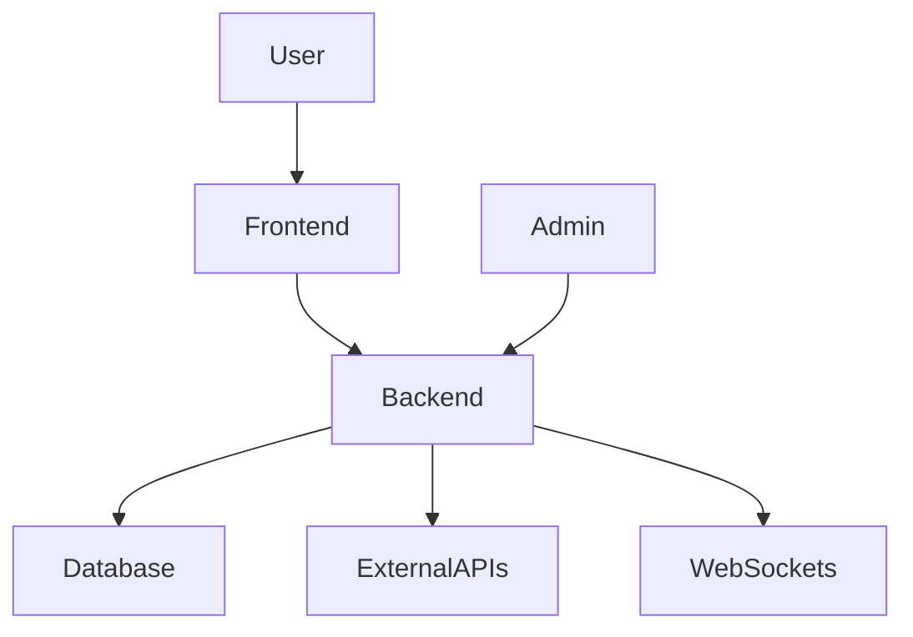

# 🌍 Natural Disaster Management System 🌪️🔥🌊

## 📌 Overview
The **Natural Disaster Management System** is a web-based platform designed to provide real-time updates on natural disasters, helping users stay informed and take necessary precautions during emergencies. It aims to improve disaster preparedness and response efficiency by offering critical information to users and supportive units.

## 🚀 Features
- 🌍 **Real-time Updates** – Get instant notifications on disasters in your area.
- 📍 **Live Location Integration** – View disasters on an interactive map.
- 🔐 **User Authentication** – Secure login and registration system.
- 🆘 **Emergency Services Integration** – Connect with emergency responders.
- 📊 **Disaster Forecasting** – Predict and analyze upcoming disaster risks.
- 📝 **Admin Dashboard** – Manage disaster reports and user interactions.
- 📢 **Public Awareness Alerts** – Notify users about precautionary measures.

## 🛠️ Tech Stack
- **Frontend:** React.js, Tailwind CSS
- **Backend:** Node.js, Express.js
- **Database:** MongoDB
- **Authentication:** JWT (JSON Web Tokens)
- **Real-time Data:** WebSockets, Google Maps API
- **Hosting:** AWS, Vercel

## 🏗️ System Architecture (MERN Stack)


## 🎯 How to Run the Project
1. **Clone the Repository**
   ```sh
   git clone https://github.com/your-username/Natural-Disaster-Management-System.git
   cd Natural-Disaster-Management-System
   ```

2. **Install Dependencies**
   ```sh
   npm install
   ```

3. **Set Up Environment Variables**
   - Create a `.env` file in the root directory and configure API keys, database URL, and authentication secrets.

4. **Run the Application**
   ```sh
   npm start
   ```

5. **Access the Platform**
   - Open [http://localhost:3000](http://localhost:3000) in your browser.

## 📸 Screenshots
### 🔹 Homepage


### 🔹 Real-time Disaster Map


## 👨‍💻 Team Members
- **Suhansa Kashmira** *(Team Leader)* – User Authentication, Location Services, Disaster Management

## 📜 License
This project is open-source and available under the [MIT License](LICENSE).

## 🤝 Contributing
We welcome contributions! Follow these steps to contribute:
1. Fork the repository
2. Create a new branch (`feature-branch`)
3. Make changes and commit (`git commit -m "Your message"`)
4. Push to your fork (`git push origin feature-branch`)
5. Open a pull request    

## 📩 Contact
For inquiries or suggestions, reach out to [suhansa2816@gmail.com](suhansa2816@gmail.com).

---
💡 *Stay prepared, stay safe!* 🚨

